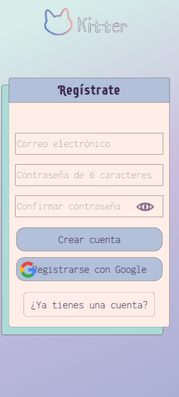
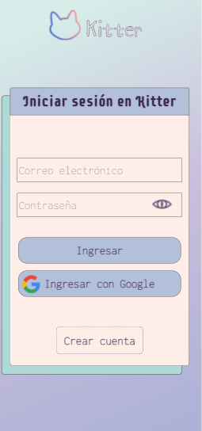
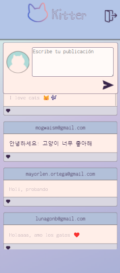

# Creando una Red Social

## Índice

* [1. CARACTERÍSTICAS DEL PRODUCTO](#1-definición-del-producto)
* [2. HISTORIAS DE USUARIO](#2-historias-de-usuarios)
* [3. PROTOTIPOS](#3-prototipos)
* [4. TEST DE USABILIDAD](#4-test-de-usabilidad)

 ### 1. CARACTERÍSTICAS DEL PRODUCTO
 
 Kitter es una red social que invita a dueños y dueñas de gatos a unirse para compartir información de utilidad acerca de los mininos y su óptimo cuidado. Esta red social consiste en una SPA responsiva, elaborada bajo el concepto "mobile first" que invita a los usuarios a registrarse con un correo electrónico y una contraseña. También ofrece la opción de registro con google. Una vez registrado, el usuario deberá confirmar su registro dando click al link de verificación que llegará a su correo electrónico. De este modo, podrá ingresar, con los datos proporcionados al crear la cuenta, a un muro en el que podrá escribir posts públicos.
Cada usuario podrá editar y borrar sus propios post si así lo desea. Tam,bién habrá un botón para desloguearse y salir del muro.

  

          

### 2. HISTORIAS DE USUARIO

Este proyecto fue elaborado para responder a tres historias de usuario, las cuales abordan los siguientes aspectos:

- Registro o creación de cuenta con email y contraseña o cuenta de google.
- Ingreso con datos proporcionados en el registro o con cuenta de google.
- Muro para escribir y leer post con la opcíon de editar y borrar post propios.

### 3. PROTOTIPOS

#### a) Prototipo de baja fidelidad

#### b) Prototipo de alta fidelidad

### 4. TEST DE USUARIOS

Se realizó una encuesta usando un google form en la que las usuarias, antes de responder, debían registrarse y confirmar su registro con el link de verificación para luego ingresar y crear un post.
